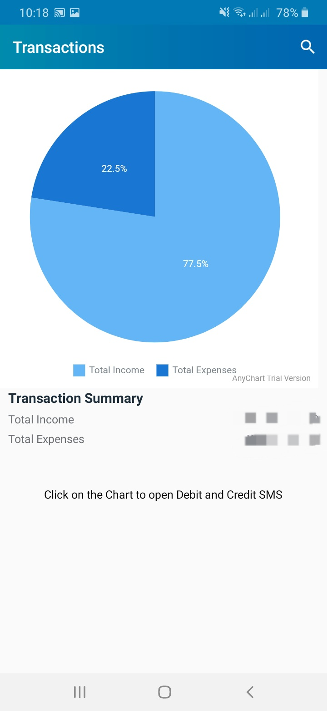
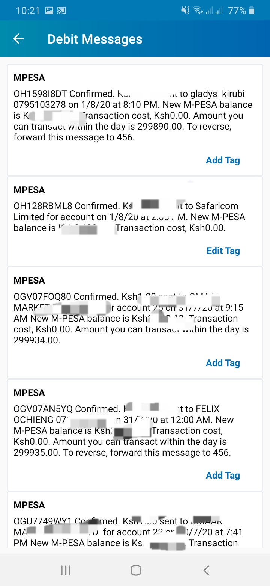
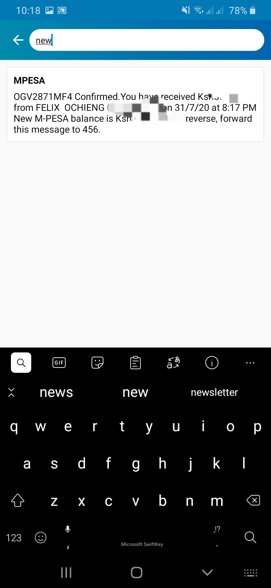
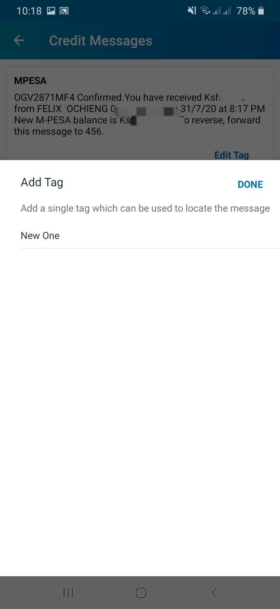

# Spending-Calculator-MVVM-Clean-Architecture

The App reads the user sms, take notes of transactional sms and create total income and total expenses in a pie chart. The users can also add tag to the messages for future refference. Currently the app is only able to detect Kenyan and Indian currencies.

### Prerequisites

The project has all required dependencies in the build.gradle file.

## Architecture

The project uses MVVM architecture pattern.

## Libraries 

* [AnyChart](https://github.com/AnyChart/AnyChart-Android) - Used for Piechart
* [Room](https://developer.android.com/training/data-storage/room) - Provides abstraction layer over SQLite
* [ViewModel](https://developer.android.com/topic/libraries/architecture/viewmodel/) - Manage UI related data in a lifecycle conscious way and act as a channel between use cases and ui
* [DataBinding](https://developer.android.com/topic/libraries/data-binding) - support library that allows binding of UI components in layouts to data sources,binds character details and search results to UI
* [Navigation Component](https://developer.android.com/guide/navigation/navigation-getting-started) - Android Jetpack's Navigation component helps in implementing
navigation between fragments

## Screenshots
|||||
|:----:|:----:|:----:|:----:|

||
|:----:|

## License

 ```
   Copyright 2020 Ronnie Otieno
   
   Licensed under the Apache License, Version 2.0 (the "License");
   you may not use this file except in compliance with the License.
   You may obtain a copy of the License at

       http://www.apache.org/licenses/LICENSE-2.0

   Unless required by applicable law or agreed to in writing, software
   distributed under the License is distributed on an "AS IS" BASIS,
   WITHOUT WARRANTIES OR CONDITIONS OF ANY KIND, either express or implied.
   See the License for the specific language governing permissions and
   limitations under the License.
 ```
